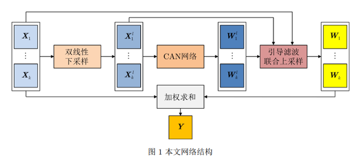
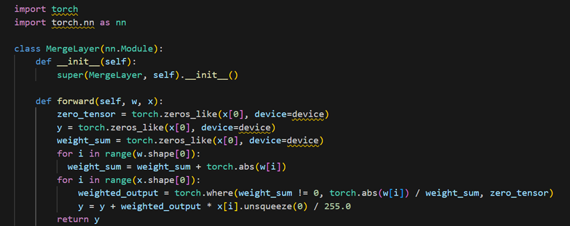
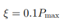

# 期末作业——基于深度引导与自学习的高动态成像算法

## 团队：OUC-Best-CV                 成员：陈亚妮，刘宇宙，韩翔，韩冀恺

## 视频链接：

【【计算机视觉】中国海洋大学OUC-Best-CV小组项目】 https://www.bilibili.com/video/BV1ys3gedE1i/?share_source=copy_web&vd_source=3aa9ee0c4fcf2e52762a44f906c09534

## 绪论：定义问题和动机

### 选择的方案

​		根据老师上课提出的三种可选择的方案，我们选择针对没有开源的工作进行代码复现。因为一篇未开源的论文往往意味着更大的技术挑战。经过讨论，我们认为复现一篇未开源的论文更有利于我们提高自己的编程能力和问题解决能力。而且论文复现也是我们深入学习计算机视觉领域算法的有效途径，比如下文中提到的引导滤波算法、CAN网络结构等，就是我们在论文复现中深入学习的新内容。当然考虑到时间限制和当前学业水平的限制，我们也针对自己的情况对所实现的算法进行了合理的简化和调整，以确保在有限的时间内取得最佳的学习效果和运行结果。

​		我们没有选择对已有方法进行改进，一方面是，我们目前学习的知识还比较基础，也不够全面，不足以支持我们完成对算法的改进工作，另一方面，如果只是做组合式创新的话，我们认为工作量可能较小，无法很好的锻炼我们的能力，所以最终放弃了这个选项。

​		而提出一个新的实现高动态范围成像的算法，需要我们阅读大量的文献，深入了解当前计算机视觉领域的研究现状和发展趋势。然后分析现有方法的不足，为提出新方法提供依据和启示。因为我们的首要目标是尝试学习使用新技术，并在期限内完成实验，所以考虑到时间因素，我们没有考虑提出高动态范围成像领域的新算法。

### 项目介绍

#### 前期准备

​		1.我们通过查阅大量的文献，查找了HDRI的相关内容。在《基于深度引导与自学习的高动态成像算法》一文中，作者提出了一个基于深度引导与自学习的多曝光图像融合网络MEF-Net；在《Recovering High Dynamic Range Radiance Maps from Photographs》一文中，作者提出了一种从传统成像设备拍摄的照片中恢复高动态范围辐射图的方法，通过用不同的曝光量图片恢复成像过程的响应函数，将多张图片融合成一个高动态范围的亮度图，该论文的作者正是最早提出HDRI技术的Debevec（[How to pronounce Debevec | HowToPronounce.com](https://www.howtopronounce.com/debevec)）；在《基于亮度分区模糊融合的高动态范围成像算法》一文中，作者提出通过将亮度分成两个区间可以使低亮度区域的亮度增加、范围扩大，高亮度区域的亮度减小、范围扩大，从而增大图像的整体对比度，保留色彩和细节信息。《基于深度引导与自学习的高动态成像算法》这篇里的算法，也涉及比较多的公式，毕竟还有损失函数的计算，比较难的应该就是F2范数的计算。其他几个都有函数可以计算的，然后比较难的就是自学习部分，但是也可以选择不进行自学习，就是效果略微差一点。参考这些文献，了解到HDRI领域仍然值得我们发掘，最后我们选择融合上述论文中提到的方法。

​		2.我们通过搜索网络上的博客，在知乎里看到HDR+的思路（https://zhuanlan.zhihu.com/p/90093872），这篇文章应该是参考了多篇文献的，还包含多张RAW图像混合，加权融合之类的；在CSDNhttps://blog.csdn.net/u011231598/article/details/115308111里看到“网络也可以具有对齐功能”以及去鬼影的思路，这些思路启发我们思考如何构建更加强大的模型。

​		3.感觉要是做hdr+的话，除了去鬼影还可以考虑在对图像处理前先进行降噪或者对噪声约束处理之类的，还可以更改权重函数和加权融合函数等，这些都在上面那篇知乎的文章中提到了。但是这篇文章的参考文献最近的一篇是2017年的，都比较早，可能不适合做论文复现，比较适合组合式创新。而且CSDN博客里也提到了选帧、反马赛克之类的，就是没有细说，也是可以考虑的创新点吧，就是不大了解。

​		4.https://geeksmonkey.com/ji-shu-qian-yan-zong-shu-bao-gao-shang/ 这篇综述中也提到了其他的修正方法和色调映射的方法。

而且经过搜索，好像没什么做实时高动态范围成像的，也可以考虑把智能计算系统中实时风格迁移图像修改一下用到高动态范围成像里，这个应该也算是组合式创新吧。还可以做处理视频的高动态范围成像，老师给的论文里好像有一篇是处理视频的，如果处理视频的话，就是在那个论文的基础上添加我们自己的创新想法。或者想一下新方法，比如学一下数学的其他映射函数、权重函数、加权融合函数之类的。

​		5.GAN网络的话，要想一想怎么做创新。而且GAN也涉及预训练之类的，也有监督或者半监督学习，就要学习一些网课，补充一下相关的知识，要不可能会看不懂代码。代码里有.index文件，可能是一个网站。如果是网站拍视频还可以把网站的链接放到提交的文档里的话。

​		6.我们通过与老师交流，探讨算法实现的可行性。

#### 代码实现

​		1.对多曝光图像序列{xk}进行双线性下采样，获得降采样的图像序列{Xkl}以减少数据的运算量 。

​					

​				下采样前：

​				下采样后：

​		2.CAN网络以降采样的图像序列为输入，输出低分辨率的权重图 。 

​		3.然后，以初始输入的多曝光图像序列为引导图，对权重图进行引导滤波（Guided Filter）（是一种基于局部线性模型的图像滤波方法，由何凯明（Kaiming He）等人提出。它是一种高效、快速且效果优良的滤波方法，可以用于去噪、图像增强、HDR压缩、图像融合等多个领域。引导滤波的核心思想是利用一幅引导图（通常是输入图像本身或者其变形）来控制滤波过程，使得滤波结果具有更好的边缘保留特性。）。

​		4.联合双线性插值（Bilinear Interpolation）（是一种常用的图像上采样技术，用于通过插值来增加图像的分辨率。双线性插值是在二维空间中进行的，它利用邻近的四个像素的值来计算新像素的值，从而在图像上生成平滑的过渡效果。）上采样，获得全分辨率的权重图。

​		5.最后融合图像Y根据多曝光图像序列的加权求和获得。其中，加权求和的计算⽅法是最终得到的权重图与原始输入的多曝光图像的Hadamard乘积求和（Hadamard乘积也称为逐元素乘积，是对两个相同大小的矩阵进行逐元素相乘的操作；求和则是将Hadamard乘积的结果矩阵中的所有元素相加。）。

​		最后，还需要对权重值做非负和归⼀化处理。 文中所采⽤的损失函数公式是这样的：

​		由强度保真约束项（通常用于图像处理和计算机视觉中的优化问题，其目的是确保在优化过程中保持图像的原始强度或亮度特征。这个约束项在一些任务中非常重要，例如图像增强、去噪和超分辨率重建等。）和加权的多曝光图像融合结构相似性度量项（是用于评价多曝光图像融合质量的一种指标。在多曝光图像融合中，结构相似性(SSIM)被广泛应用于衡量融合后图像与原始曝光图像之间的相似程度。）相加⽽成，这也是这篇论文的创新点。 强度保真约束项的作⽤是，将源图像的⾊彩信息尽可能多地保留下来，使得融合效果更⾃然。

加权的MEF-SSIM项在MEF-SSIM指标的基础上增加了⾃适应调节系数gamma, gamma的计算公式如下：

​		其中，d_mu的计算方法是：对源图像的全局均值进行升序排序，基于排序后的序列做差分处理，取差分中的最大值作为$d_mu \xi = 0.1P_max$, 表示强度变化参考值，系数0.1是通过统计获得的.

​		而sigma取0.2，是指数分布的方差。 当两幅源图像中出现亮度变化大于0.1P_max的情况时，随着亮度变化的值增大，自适应调节参数gamma减小； 但如果是多张源图像中出现亮度变化大于0.1P_max的情况，则比重取决于曝光图像的数量K，图像数量越多，则亮度变化对自适应调节参数gamma的影响越小。我们对于损失函数的代码实现是这样的：

​		模型的实现完成之后，我们开始编写训练函数。论文中实验设计的优化器为Adam，初始学习率为1e-4，最大迭代次数为500。我们的参数设置与论文同步。

### 所用的工具和资源

数据集：https://github.com/hangxiaotian/Perceptual-Multi-exposure-Image-Fusion

### 用到的技术/方法

​		1.双线性下采样

​				双线性下采样是一种常用的图像处理技术，用于减小图像的分辨率。在进行双线性下采样时，原始图像中的每个像素都会被保		留，但输出图像的分辨率会降低。这是通过对原始图像中的像素进行加权平均来实现的，以生成输出图像中的新像素。

​				双线性下采样使用了原始图像中每个输出像素周围的四个最近邻像素。对于每个输出像素，其值是这四个最近邻像素值的加权平		均。这四个最近邻像素通常形成一个矩形区域，因此称为双线性。这种方法可以保持图像的整体结构，并减小图像的尺寸。

​		2.CAN网络

​				CAN网络的全名是Context Aggregation Network，即“上下文聚合网络”，是一种在深度学习领域中用于图像分割任务的神经网络架构。它通过聚合不同尺度和位置的上下文信息，来增强网络对复杂场景的理解和解析能力。CAN网络采用空洞卷积的方式，在不牺牲图像空间分辨率的情况下，获得更大的感受野。

​				文中所采⽤的CAN⽹络结构如图所⽰，前6个卷积层包括：卷积核⼤⼩为3x3，卷积核数⽬为24的卷积运算和带泄露的线性整流(Leakage Rectification Linear Unit, LReLU)激活函数。每⼀层卷积后使⽤⾃适应归⼀化操作以避免梯度消失，还可以加快学习收敛速度。最后一层卷积操作用于生成和输入图像大小一致的权重图，卷积核⼤⼩为1x1，且不使用自适应归一化操作。此外{Xkl}以权重共享的方式输入CAN网络，来保证本网络可以融合任意数量的不同曝光度图像。

​				Leakage Rectification Linear Unit（LReLU）是一种激活函数，它是对传统的线性整流单元（ReLU）的改进。与ReLU在输入小于零时返回零不同，LReLU在输入小于零时返回一个较小的斜率乘以输入的值。LReLU的定义为：LReLU(x) = max(a * x, x)，其中，`x`是输入，`a`是一个小于1的常数，在通常情况下取一个接近于0的小值。相比于ReLU，LReLU引入了一个非零的负数斜率，以解决ReLU在负数区域的输出为零所带来的稀疏激活和梯度消失等问题。通过引入非零斜率，LReLU可以更好地处理负数输入并保留一定的负数激活。

​		3.引导滤波联合上采样

​				引导滤波的基本原理是利用一个引导图像来指导滤波过程，从而保留图像的结构信息。给定一个输入图像I和一个用于引导的辅		助图像P，引导滤波的输出图像Q可以通过$Q(i)=a(i)I(i)+b(i)$计算得到。

​				引导滤波可以更好地保留图像细节，有效保持图像的边缘特征，同时计算效率较高。

​		此外，我们的代码中也使用了融合函数、损失函数、推断函数等，在此不做进一步展开了。

### 遇到的问题及解决方法

​		1.以前对于PyTorch的语法不够熟悉，因此在正式书写代码之前学习了PyTorch的用法，并针对性地学习PyTorch实现反向传播的操作。

​		2.在撰写代码的过程中，对迭代次数和学习率等参数的设置不熟悉，参考我们搜集的论文并加以尝试，调整出合适的参数。

​		3.在最初进行数据处理时，由于没有使用data loader将数据分成小批次，也就是小的batches，程序经常会发生崩溃。这是因为一次性读入所有数据会占用大量内存，当数据量较大时，内存会爆满。后来，当尝试使用GPU进行加速时，由于显存的限制，同样的问题在GPU上也会发生。通过改用数据加载器并将数据分批次读取，这个问题得到了改善，因为分批次处理能够有效地减少内存和显存的使用量，从而使程序更加稳定且高效地运行。

​		4.一开始对网络结构不熟悉，错误地将下采样、上采样、加权求和写到了网络外面。后续调整代码并将其融合进了网络的内部。

## 结果

​		最后，我们以⼀组多曝光图像序列作为输入，模型最终输出的融合图像是这样的： 

可以看出，图像中亮部和暗部的细节都保持得很好，很真实地再现了⾃然场景中的颜⾊，非常⽣动生成的图像效果非常好。在保留了图像暗部细节的同时，使得亮部不至于过分曝光。

## 总结和讨论

​		由于代码中暂时未引入自适应算子，如果该项目继续下去，我们团队OUC-Best-CV会利用自适应算子在遗传算法中通过不断调整选择操作的参数，使得算法能够更好地适应问题的特性。

​		在这次的实验过程中，虽然已经知道论文复现的难度会很大，但是事实上，复现的难度远超我们的想象。我们在五一前就确定了要复现的论文。然后就着手进行编程，但是在前期，也就是五月上旬，因为对论文中提出的很多算法并不熟悉，我们先进行了相关知识的补充学习，尽管已经学习了相关的算法，在实现过程中还是遇到了很多问题。刚开始我们对论文的理解有误，没有将双线性下采样、引导滤波、上采样等加入网络模型，而是简单的将它们作为串行操作放在了CAN网络的两侧，没有参与反向传播。导致训练时损失不下降的问题。为了解决损失不下降的问题，我们再次阅读了论文，经过几个小时的讨论，终于把损失函数和MEF-Net的网络结构彻底弄明白。另外，在实现CAN网络时，需要实现自适应算子，因为没有系统的学习过相关的内容，考虑到时间限制，我们放弃对自适应算子的实现，将自适应归一化操作转为批归一化操作，幸运的是，这样的修改没有导致结果的明显差异。但是因为前面为了解决数据处理、模型参数设置和网络结构等问题，我们已经花费了很多时间，对自学习的理解欠佳，所以我们没有继续复现论文中的自学习算法，导致对两幅极度曝光图像的融合效果并不好，后面会进一步学习实现相关的内容。

## 个人贡献声明

陈亚妮（25%）：整合文献提出创新点，共同完成“使用dataloader进行图像读取，对多曝光图像序列{xk}进行双线性下采样，获得降采样的图像序列{Xkl}以减少数据的运算量，引导滤波联合上采样，训练模型”部分代码，参与视频拍摄，撰写实验报告大纲。

刘宇宙（25%）：小组讨论，发表见解，共同完成使用dataloader进行图像读取，对多曝光图像序列{xk}进行双线性下采样，获得降采样的图像序列{Xkl}以减少数据的运算量，引导滤波联合上采样，训练模型”部分代码，参与视频拍摄，完成配音等工作。

韩翔（25%）：查阅大量文献，共同完成“构建神经网络，损失函数，融合函数等”部分代码的实现，导演及剪辑视频，设计PPT，完成配音等工作。

韩冀恺（25%）：查找资料，提供技术方法支持，共同完成“构建神经网络，损失函数，融合函数等”部分代码的实现，承担花絮拍摄及视频的剪辑，提供拍摄设备，完成配音等工作，撰写实验报告。

## 引用参考

